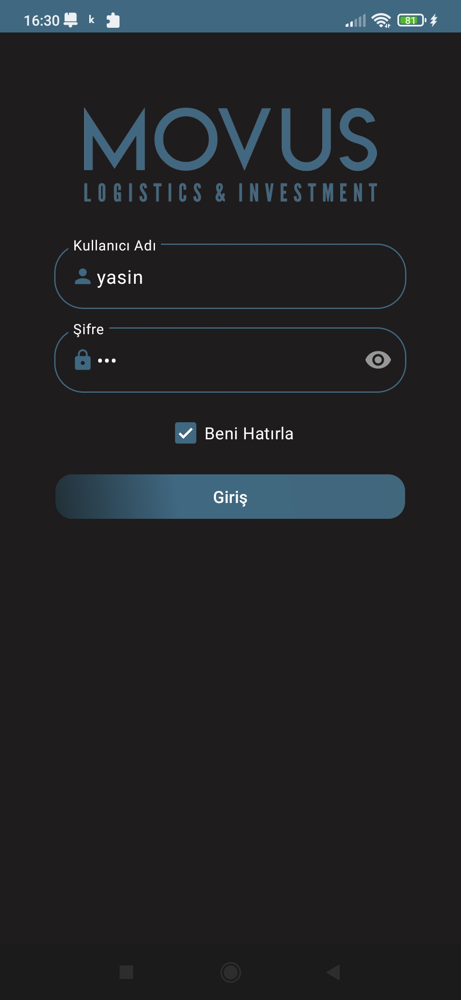
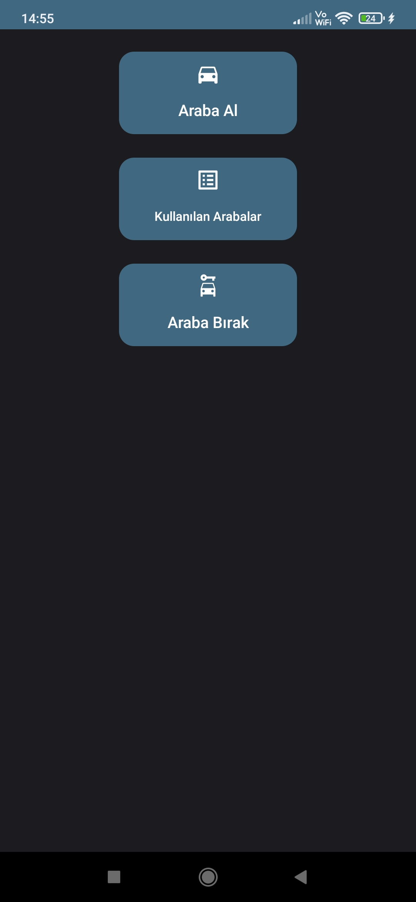
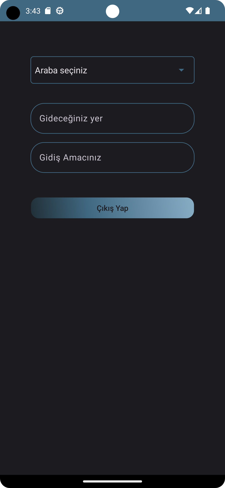
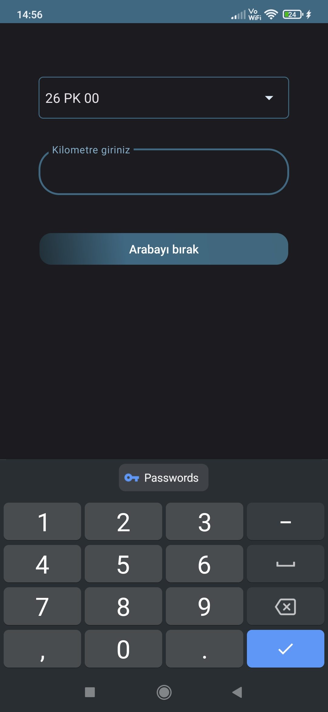
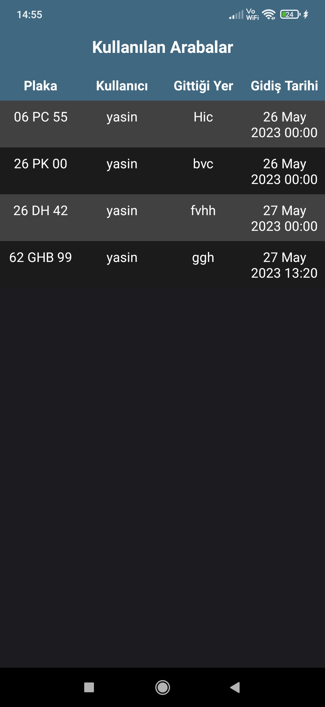

# Movus Android

This is an Android app developed for tracking company cars. The app allows users to perform actions such as renting a car, returning a car, and viewing the list of available cars.

# Features

   1. Rent a Car: Allows users to rent a company car by selecting from a list of available cars, providing the destination and purpose of the trip.
   2. Real-time Car Availability: Fetches the list of available cars from a remote server to ensure up-to-date information.
   3. Integration with Backend: Communicates with a backend server via HTTP requests to fetch car data, insert rental information, and delete car records.
   4. User-friendly Interface: Utilizes spinners, text inputs, and dialog boxes to guide users and provide feedback on their actions.

# Getting Started

To run the app on your local machine, follow these steps:

    Clone the repository: git clone https://github.com/YasinOkat/MovusAndroid.git
   1. Open the project in Android Studio.
   2. Build and run the app on an emulator or physical device.
   3. Make sure to update the URL constants in the code to match the URL of your backend server.

# Screenshots

  
  

  
  

  

# Dependencies

The app uses the following dependencies:

    AndroidX AppCompat: Provides compatibility for newer Android features on older versions of Android.
    OkHttp: Handles HTTP requests and responses.
    RxJava/RxAndroid: Enables reactive programming and provides a convenient way to handle asynchronous tasks.
    Gson: Helps in serializing and deserializing JSON data.

# API Endpoints

The app interacts with the following API endpoints on the backend server:

    GET_ARABALAR_ENDPOINT: Fetches the list of available cars.
    INSERT_DATA_ENDPOINT: Inserts rental information into the server.
    DELETE_DATA_ENDPOINT: Deletes car records from the server.
    ARABA_BIRAK_ENDPOINT: Return the car.
    URL_GET_KULLANILAN_ARABALAR: Fetch the list of the used cars.
    LOGIN_ENDPOINT: Returns the user list.

# License

This project is licensed under the GNU General Public License (GPL). See the LICENSE file for more information.
